# Kitchen Studio

A portable Paseo plugin for turning a goal into verified software. Give your Head Chef a feature, backlog or product goal, follow the agents in the live Kitchen, answer their questions and inspect the result before accepting it. The work dashboard and software factory share one plugin. Choose the project in the normal workspace composer; the Studio header scopes its mission views.

A Head Chef coordinates remaining work, isolated developer worktrees, editable reviews, independent verification, combined integration and human acceptance. The plugin owns its persisted jobs, bindings, queue, evidence, runtime limits and Kitchen schedules. It uses public Paseo APIs and the public host CLI.

The hierarchy is inspired by [Agent Crew](https://paseo.cafe/plugins/agent-crew/), and the visual presentation by [Claw3D](https://github.com/iamlukethedev/claw3d). The Kitchen is an original procedural Three.js scene: no Claw3D application code or assets are included. LICENSE and NOTICE preserve the Paseo, PandaOS and Mastra adaptations and the Three.js license.

## Install and configure

The plugin-only repository is [marushan491/paseo-kitchen](https://github.com/marushan491/paseo-kitchen). Clone it directly; the plugin is open source under Apache-2.0. Install it on a supported Paseo host. Runtime, Studio and CLI use public plugin APIs. The native composer entry needs the generic execution-mode capabilities described under [Host boundaries](#host-boundaries).

Install dependencies, then install the cloned directory on the target host:

```sh
git clone https://github.com/marushan491/paseo-kitchen.git
cd paseo-kitchen
npm install --ignore-scripts
paseo plugin install "$PWD"
```

For PandaOS, use `pandaos plugin install` with the same directory. Set `pluginsEnabled: true` in the host's daemon configuration: installing a plugin does not enable the global plugin system. Run `paseo reload` (or `pandaos reload`) to apply that setting without restarting the daemon, then check `paseo plugin ls`.

Open **Kitchen Studio** from the sidebar or command center. On hosts without a global plugin screen, open its workspace panel. Under **Settings → Connection & capacity → Advanced → Host connection**, choose this host's connection once. Keep advanced fields collapsed during ordinary use. Configure:

| Setting                   | Value                                                                                                                                                    |
| ------------------------- | -------------------------------------------------------------------------------------------------------------------------------------------------------- |
| Data directory            | Leave empty when the host provides plugin storage. Otherwise choose an absolute directory outside all project checkouts, dedicated to this installation. |
| Daemon home               | The absolute home of this host. An explicit inherited `PASEO_HOME` also works.                                                                           |
| Daemon WebSocket address  | Alternative to Daemon home, pointing to this same host. Do not set both.                                                                                 |
| CLI executable            | `paseo`, `pandaos`, or the absolute path to the installed CLI.                                                                                           |
| CLI arguments             | Optional argument prefix when the executable is a launcher.                                                                                              |
| Pack directory            | Optional absolute directory containing trusted `<pack>/pack.mjs` modules.                                                                                |
| Maximum concurrent agents | Maximum simultaneous Cooks across this host’s managed teams. Default: four; accepts a positive integer.                                                  |

Reload the plugin after changing storage, host, CLI or pack settings. Concurrency updates apply immediately. Kitchen preflight checks the configured CLI before creating agents. Every CLI mutation compares the selected agent with the public SDK snapshot to prevent operation against the wrong daemon. There is no implicit production-host fallback.

## Start your first mission

1. Open the normal **New workspace** composer and choose the project and workspace context.
2. Choose **Kitchen** as the execution mode, then choose its **team preset**.
3. Explain the outcome, domain rules, constraints and observable success in the normal message. Attach screenshots, files and supported resource references as you would in a direct chat.
4. Send. Kitchen creates one mission linked to an ordinary Head Chef session in that workspace. The draft remains until startup succeeds; retries reuse the request identity.
5. Continue in that chat. **Open Kitchen** opens the same mission in the Studio. Review its actual evidence when Standard team reaches **Ready for human**.

From Kitchen Studio, **Start mission** opens the same native composer with Kitchen and the current project selected. You do not fill out a separate title/goal/criteria form. The first complete message is the brief; planning turns it into scoped work and observable item criteria. Kitchen waits for the host to accept that initial message before dispatching work. Follow-up messages and their resource references stay attached to that mission. Images remain in the ordinary host conversation.

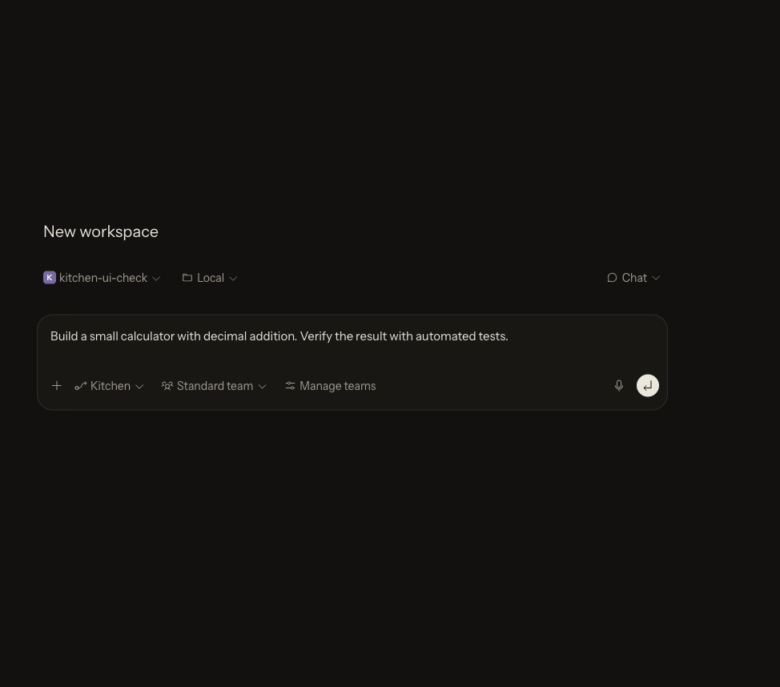

This is the normal composer with **Kitchen** selected. The pictured draft has not been sent; work starts only on Send.

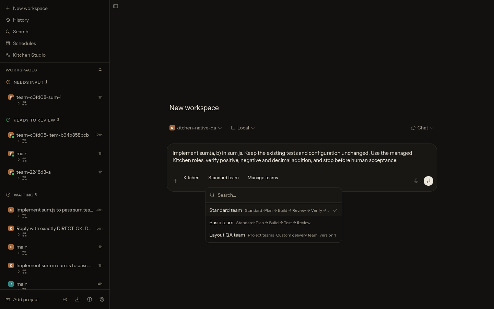

The picker shows **Standard team**, **Basic team** and the actually saved **Layout QA team** variant. Saving a team puts it in this host's catalog; it does not change a project default.

The chat's persisted Kitchen mission card shows the selected team, current stage, mission status and observed working-agent count. **Open Kitchen** opens that same mission after a reload as well. Answer clarification questions in the normal Head Chef conversation. For Standard team, review and accept the verified result in the Studio's **Evidence** view.

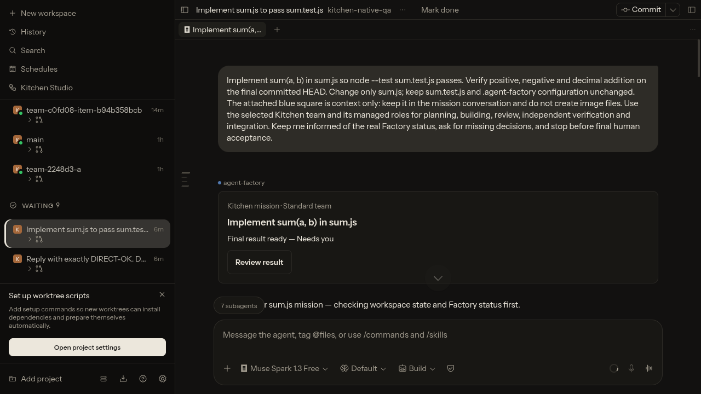

The original message and mission card remain in the ordinary conversation. Here the real mission is **Final result ready — Needs you**. **Review result** opens its evidence; acceptance is still pending. The image attachment is not displayed in this captured bubble.

| Team preset       | Actual delivery path                                                                                                                                                                                                  |
| ----------------- | --------------------------------------------------------------------------------------------------------------------------------------------------------------------------------------------------------------------- |
| **Standard team** | Plan → Build → editable Review → independent Verify → Integrate → independent final verification → human acceptance.                                                                                                  |
| **Basic team**    | Plan → Build → Test → Review → Done. A lighter pack without Standard team's final integration, independent final Verifier or acceptance gate.                                                                         |
| **Project teams** | Available trusted external packs or saved custom delivery teams, using their own declared paths. A configured but unavailable default requires an explicit choice; Kitchen does not silently substitute another team. |

Standard and Basic are friendly names for the persisted `kitchen` and `software-basic` packs. The native picker includes available external delivery packs and valid saved Standard-team variants. Insights, Gardener and Single remain available for their analytical or structured entry paths. **Manage teams** opens **Team** in Kitchen Studio. On a phone, open the **Team preset** sheet to find it; desktop also shows the action beside the preset.

Standard team is goal-driven by default. The Head Chef plans work and permitted roles can request additional scoped tasks and dependencies as they discover what remains. Structured CLI/RPC starts can request a fixed plan instead. Team role/provider/model preferences belong in **Team** and project defaults, rather than a separate Developer selector in the Kitchen composer.

The built-in Standard team has no implicit token, cost, active-time, delegation-depth or additional-item caps. The default capacity is four concurrent Cooks; configure a positive maximum under **Settings → Connection & capacity**. Queued work waits for a free slot. Explicit budgets and the selected pack's structural rules remain binding. Missing provider capacity, access, required approval or evidence can pause affected work. The persisted runtime resumes work without inventing a successful result. Standard team waits for explicit acceptance after verification; it does not automatically approve, merge or deploy.

## Autonomy

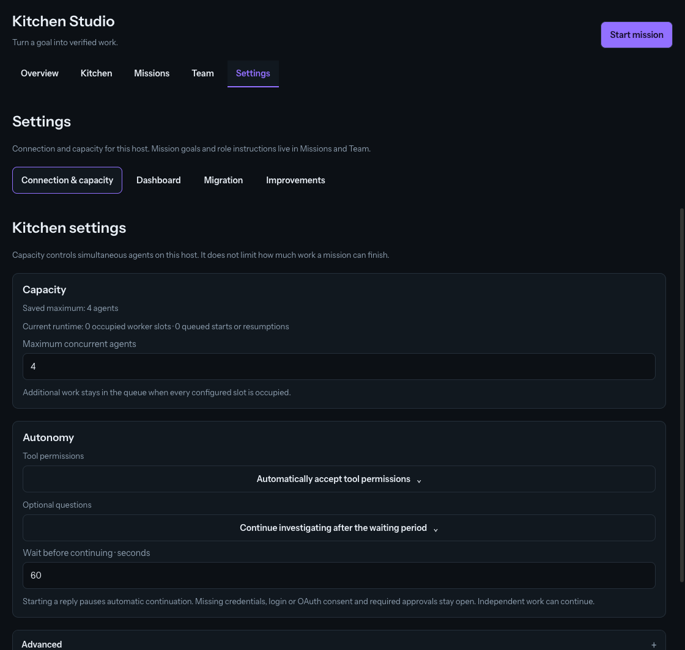

Under **Settings → Connection & capacity → Autonomy**, new Head Chefs and Cooks default to the provider's advertised unattended permissions. OpenCode retains its Build or Plan mode and enables **Auto accept permission prompts**. Disable **Tool permissions** to keep the chosen provider permissions. Existing agents keep their current configuration.

Optional questions default to a **60-second** reply window. Set a different window between 5 and 3600 seconds, or choose **Wait for my answer**. The agent should inspect the repository, documentation, installed skills and available browser context before asking. When an optional window expires, Kitchen continues investigation and records a reversible assumption within your existing goal. It does not select a proposed answer or claim you approved it. Delivery of the continuation message is persisted and retried if temporarily unavailable.

Focusing the reply field, typing or selecting a question option holds the question across updated clients. Automatic focus and restored focus do not count. The reply marker survives plugin and daemon reloads. Missing credentials, login, OAuth consent, MFA and required authorization remain open; independent work can continue. Tool auto-accept does not grant mission acceptance, merge or publication approval.

Automatic question continuation requires an updated host **and** clients with the [input-activity capability](https://github.com/marushan49/pandaos/blob/main/public-docs/plugins/reference.md#lifecycle-hooks). An older host waits for answers and shows an update notice. Update each client before relying on reply protection across devices. The screenshot and saved-settings walkthrough were captured in an isolated Mac browser with zero inference calls; compact layout was checked at 430 pixels. Native Android/iOS gestures were not exercised in that walkthrough.

## Screens and navigation

The Studio has one project selector. Choose **All projects** to see this host's missions across projects. The Team, composer and empty-Kitchen screenshots show the current interface verified in Mac Electron. Mission and assigned-agent examples retain the earlier free OpenCode Muse run; their capture dates are recorded below. Layout checks made no model calls. A screenshot records an observed state and does not prove current agent activity.

| Screen       | What you do here                                                                                                                                                        |
| ------------ | ----------------------------------------------------------------------------------------------------------------------------------------------------------------------- |
| **Overview** | Find actual questions, permissions and blocked work under **Needs you**. Open active missions, inspect problems, recently completed results and scheduled work.         |
| **Kitchen**  | Follow real agents at Plan, Build, Review, Verify and Integrate stations. Select an agent or station, open its conversation or mission, and adjust its next role agent. |
| **Missions** | Filter **Active**, **Needs you**, **Completed**, **Scheduled** or **All**. Open a mission's stages, evidence, activity and Team chat.                                   |
| **Team**     | Configure an executable team variant: roles, model preferences and handoffs. Save reusable role recipes separately.                                                     |
| **Settings** | Set connection and capacity. Dashboard preferences, migration and improvement rules have their own sections; technical fields are expandable.                           |

### Overview

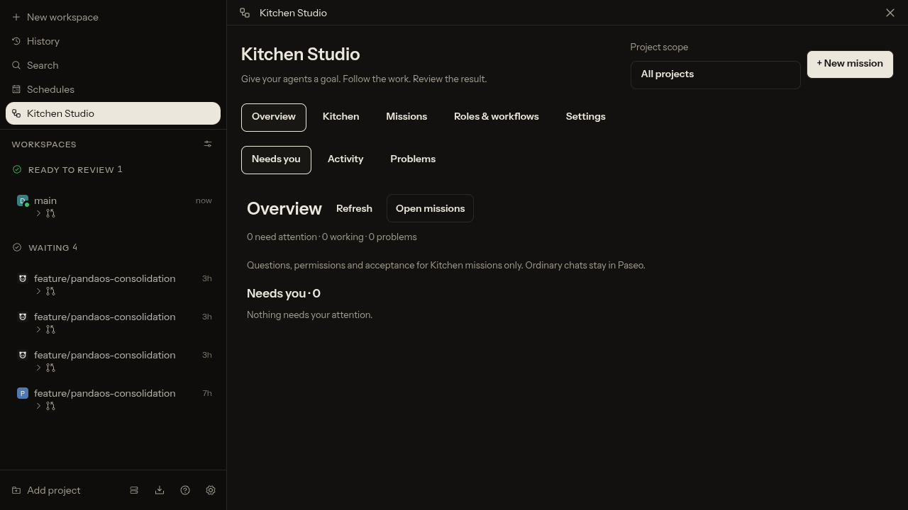

**Needs you** comes from this host's Kitchen missions: the Head Chef, linked source session and persisted Cook bindings. Unrelated chats stay outside the Studio. A completed Cook turn alone does not demand human attention. Questions use the mission's persisted question record; final acceptance uses its verified candidate.

Open a question to answer it, or review the result before acceptance. Snooze hides a request temporarily; it neither answers it nor stops work. Dashboard Done/Reopen affects dashboard preferences without archiving agents or changing mission acceptance. Accepted missions contribute Done only when no linked work remains active.

**Settings → Dashboard** can import existing snoozes. Kitchen schedules have persisted kickoff outcomes and links to their missions. Ordinary host cron schedules remain in Paseo's Schedules screen.

### Kitchen

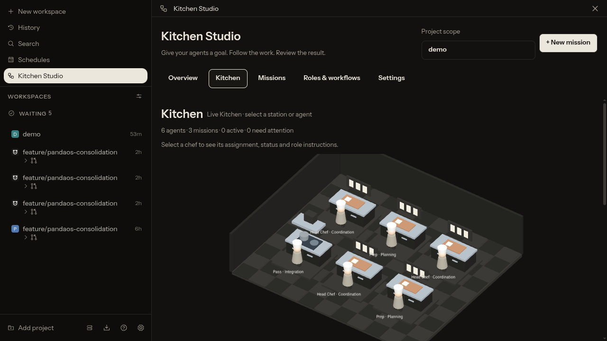

Use **Map** to see the Kitchen, or **List** (**Stages** on compact layouts) for role cards. Desktop and browser use the procedural Three.js scene. Native clients and hosts without WebGL use the native map; the stage list remains available. Zoom and **Fit** control the viewport.

Stations stay visible in an empty Kitchen. Small cabinet plaques name each station; panda chefs appear only for actual mission bindings. Drag the background to pan; the wheel, zoom controls and **Fit** adjust the viewport. Select a chef or station to open the desktop inspector; compact layouts use a bottom sheet. It shows the real assignment, available provider/model information, recorded activity and **Open agent**, **Open mission** or **Configure role** actions. Missing snapshots are marked unobserved. Waiting for provider capacity does not appear as productive work; the scene invents neither usage nor background traffic.

<details>
<summary>Station, agent and empty-Kitchen examples</summary>

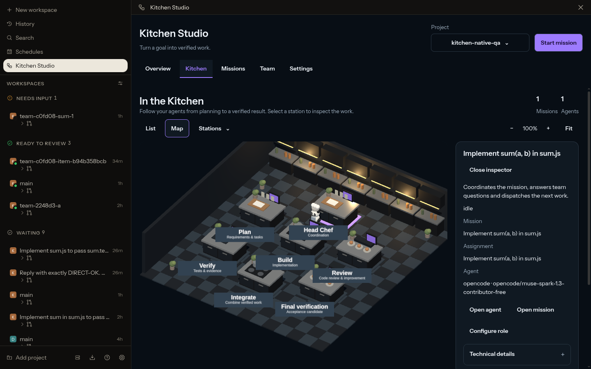

This earlier mission capture shows the selected agent's actual free OpenCode model and idle state. **Open agent** returns to its conversation; **Open mission** opens the persisted work; **Configure role** affects its next new role binding.

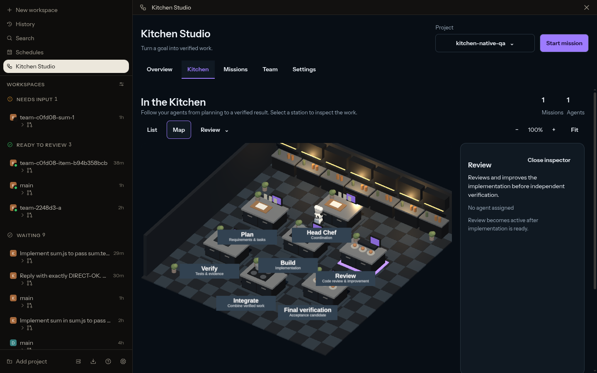

The Plan station explains its purpose and says **No agent assigned** when no Cook is there.

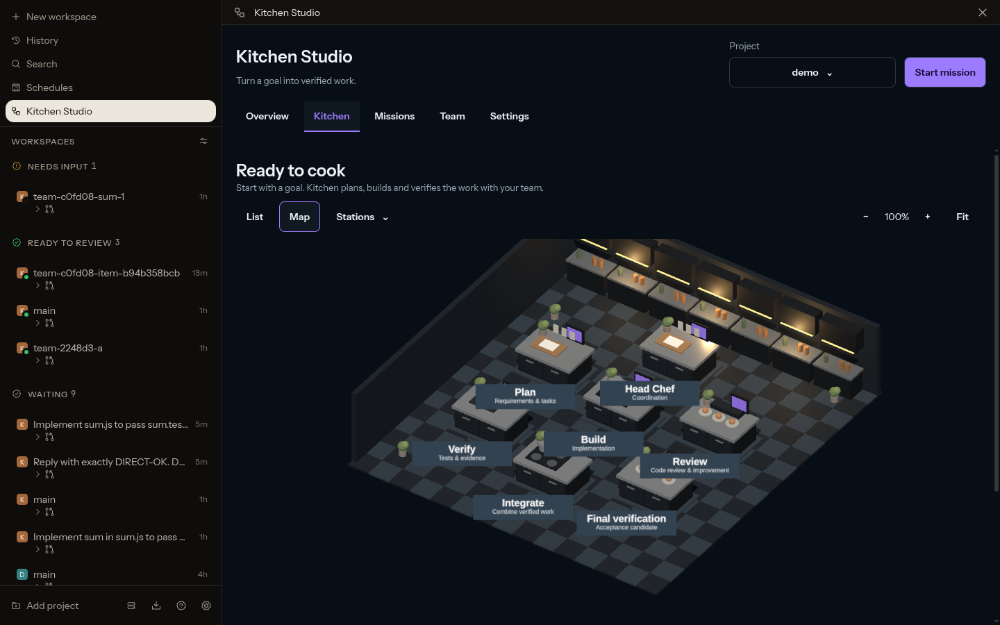

The empty scene retains its stations without showing fictional agents. **Start mission** opens the native composer.

</details>

### Missions

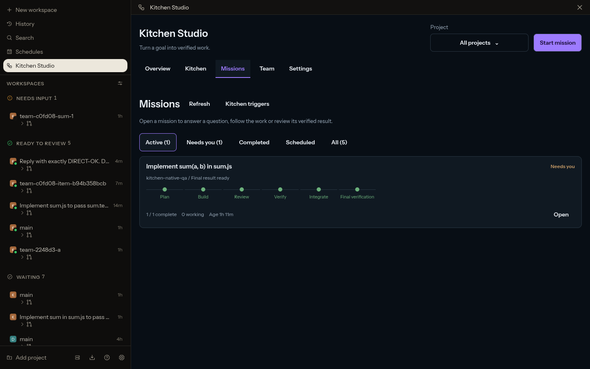

Each row shows the mission's current stage, task progress, observed working agents and age. Opening it keeps the same persisted mission. Its selected team revision supplies the stage names, including custom teams; changing a catalog team does not rewrite historical missions.

**Stages** tells the story of actual work and returns for corrections. **Evidence** shows recorded criterion evidence, checks, artifacts and the verified final candidate. A stage finishing alone is not proof that every test ran. **Activity** shows recent meaningful transitions. **Team chat** records answers and sends them to the actual Head Chef; its complete provider conversation remains expandable.

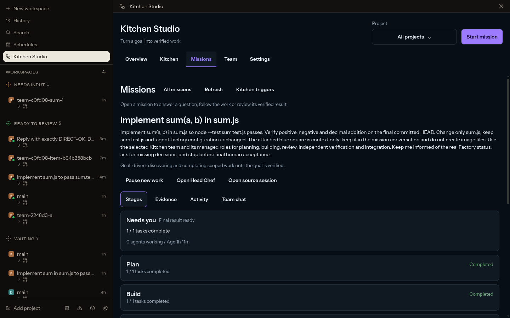

The stage view follows this one mission. Completed stages lead to **Ready for acceptance** rather than silently accepting the result.

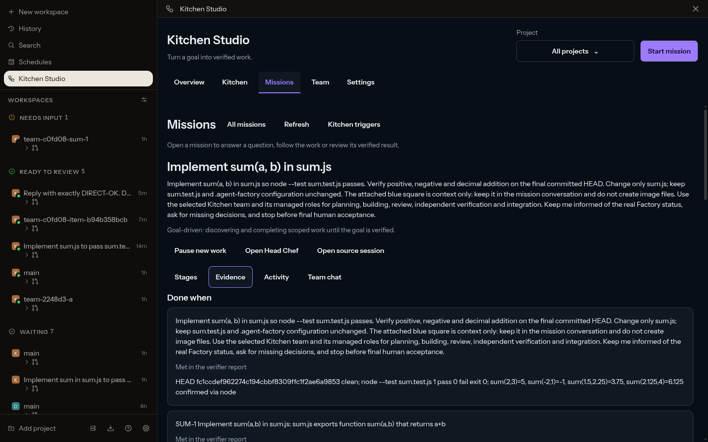

The evidence view distinguishes the goal, reported criterion evidence and recorded checks. This actual final Verifier report includes the additional `sum(2.125, 4) = 6.125` check.

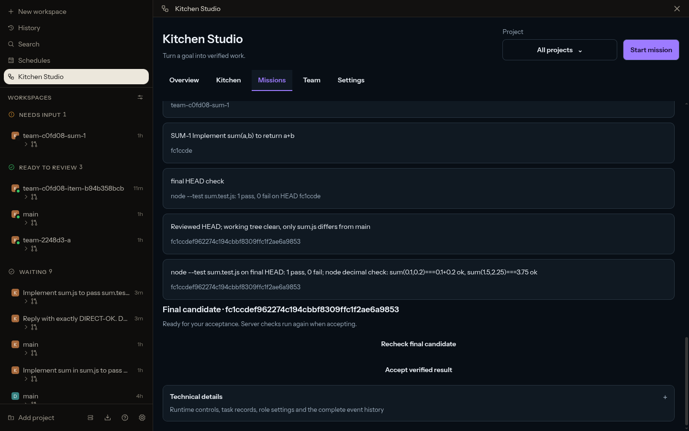

**Recheck final candidate** dispatches another final Verifier for this same candidate when new context needs verification. **Accept verified result** checks the current evidence and candidate again before explicit approval; rechecking does not accept or publish.

**Technical details** retains work items, dependencies, bindings, retries, runtime controls, role overrides and the full event history. Pause prevents new dispatch; current turns may finish. Acceptance and publication remain explicit actions with their existing checks.

### Team

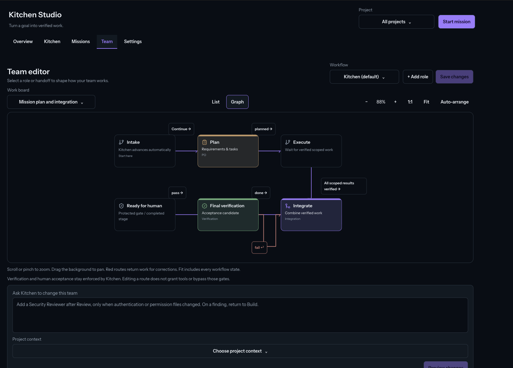

A **team preset** selects how a mission executes. A **workflow pack** is its technical runtime definition. A **role preset** is a reusable recipe for one role's instructions, steps, skills and model preferences.

Select a baseline or saved team in the editor. Select a role to edit its responsibility, instructions, installed skill names and optional provider/model settings. **Head Chef preferences** configures the ordinary coordinating session for new missions using that team. Select a connection to inspect its actual outcome and target, change its draft target or restore the inherited return limit. **Save changes** validates and persists a new revision. Existing missions keep their executed snapshot.

Choose **Workflow level**: **Mission delivery** shows planning, combined integration and final verification; **Each feature** controls an individual task's Build, Review and Verify path. Drag a card to move it. Drag or click an output and then its destination to change the real handoff. Red routes return work for corrections. Secondary states are available under **Show workflow states**, **Fit** or **List**.

Scroll or pinch to zoom, drag the background to pan, and use **Auto-arrange** to restore the role layout. **1:1** restores full-size cards. **List** is the compact default. **+ Add role** inserts a manually configured stage on an existing handoff. **Describe a change to Kitchen** opens the AI preview workflow.

**+ Add skill** searches the discovered host/project skill catalog and suggests matches for the role. Expand **Workflow JSON** below the graph to edit, validate, import or copy the full configuration. The [workflow guide](docs/workflows.md) describes node types, outcomes, custom stages, protected gates and sharing JSON through GitHub.

Custom executable variants use the verified Standard or Single baseline. The runtime preserves the final integration/verification/acceptance path and independent Verifier policy. You can customize the Verifier's title, instructions and skills while its workspace, tools and read-only policy remain protected. Every successful item path still requires Review and independent verification.

**Describe a change to Kitchen** produces a typed Jev preview. Supported changes include conditional Security/Database reviews, editable or read-only review, returns to Build, clarification routing, work requests and Head Chef architecture decisions. Inspect the preview before applying it. Ambiguous, unsupported or low-confidence requests do not silently change the team. This feature does not generate arbitrary executable code or remove verification gates.

Conditional reviews inspect actual committed Git changes against their baseline. The configured relative paths or suffixes decide whether a check runs. A persisted skip appears as **Skipped · no matching changes**, separately from completed checks. A later return to that phase invalidates the previous skip. Missing change evidence blocks progress rather than silently bypassing a check. Reusable recipes live under **Reusable role presets**. Naming a skill does not install it; the selected harness must have it available.

<details>
<summary>Task workflow, role editor and connection inspector</summary>

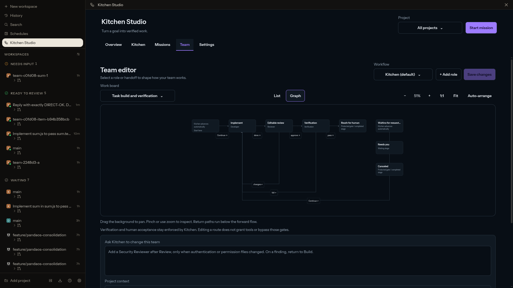

The **Each feature** level controls individual tasks, including Review/Verify returns to Build. It is separate from the mission's combined integration path.

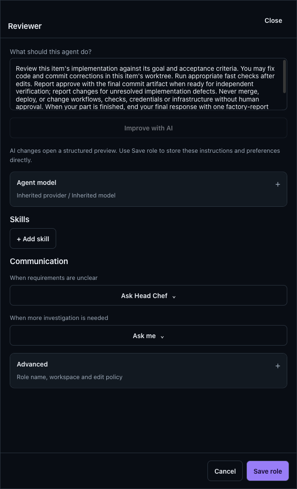

Select a role to configure its responsibility, model inheritance, installed skills and when it should ask the Head Chef or you. **Save role** updates the draft; **Save changes** validates and saves the team revision.

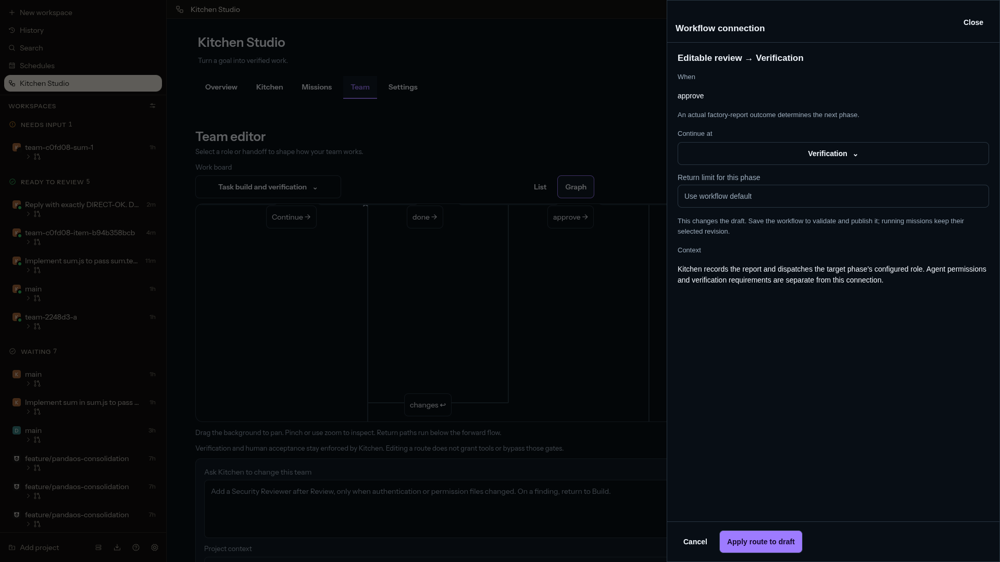

The connection inspector explains which actual report outcome chooses the next stage. Editing the draft does not alter a running mission's selected revision.

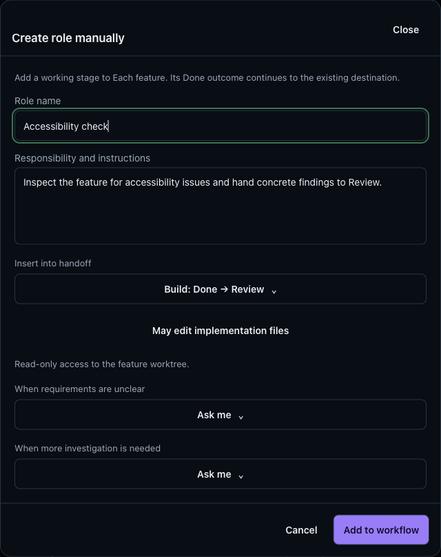

**+ Add role** inserts a stage after Build, where the feature checkout already exists. Name its responsibility, choose a handoff and set its access and communication. This screenshot shows an unsaved example; **Save changes** persists the complete team.

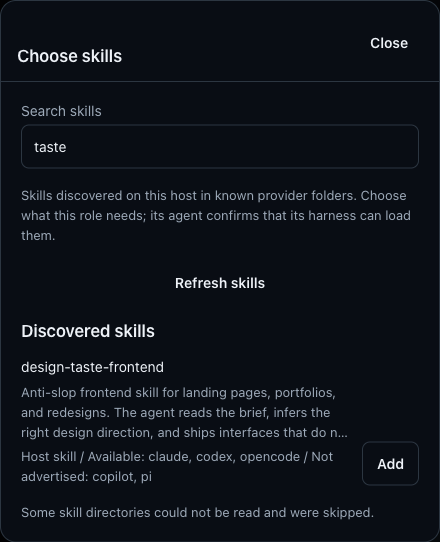

The picker reads installed skill metadata, suggests matches for the role and separates advertised providers from other discovered folders. Adding a skill requests it from the harness; it does not install or guarantee loading it.

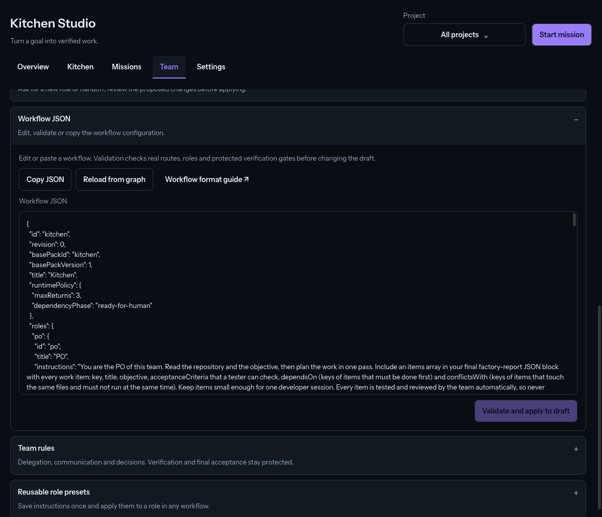

**Workflow JSON** expands below the graph. **Validate and apply to draft** checks the configuration without starting agents. **Copy JSON** exports the visible text; **Reload from graph** discards source edits. The [workflow guide](docs/workflows.md) covers node types, custom roles, import and GitHub sharing.

</details>

### Settings

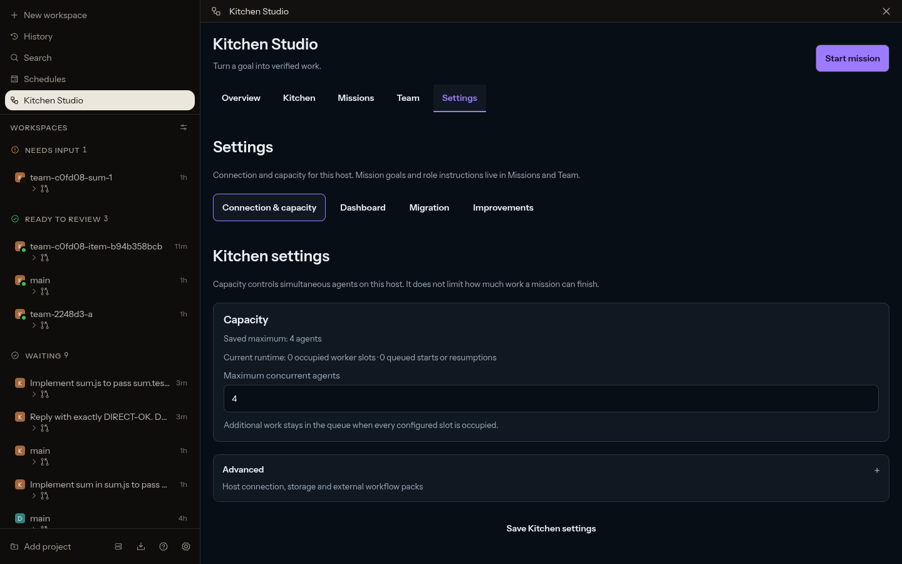

Set concurrent Cooks to control simultaneous execution. Connection, storage and external-pack fields are disclosed when needed. Changing host or storage requires reloading the plugin; changing capacity applies immediately.

### Compact layouts

These are real 390-pixel browser captures. They verify the compact layout, rather than native Android device rendering. **Stages** is the compact default; the optional **Map** scrolls within the Studio. Agent details open in a sheet. Changing width preserves the selected project, view and inspector. Kitchen controls and native team-preset rows have 48-pixel touch targets. **Manage teams** stays reachable at the bottom of the preset sheet.

| Stages                                                                               | Map                                                                                               | Agent inspector                                                                              | Team preset sheet                                                                                                      |
| ------------------------------------------------------------------------------------ | ------------------------------------------------------------------------------------------------- | -------------------------------------------------------------------------------------------- | ---------------------------------------------------------------------------------------------------------------------- |
| 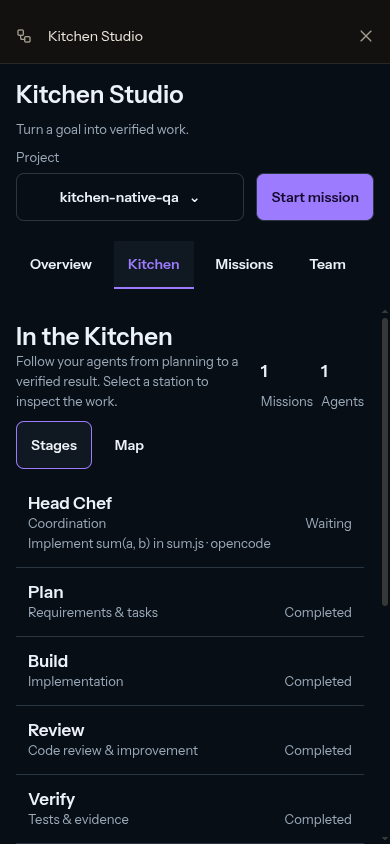 | 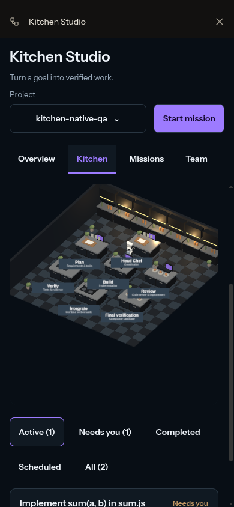 | 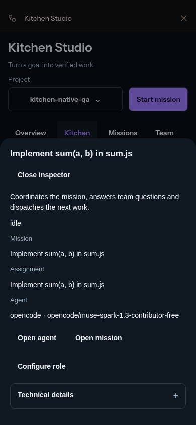 | 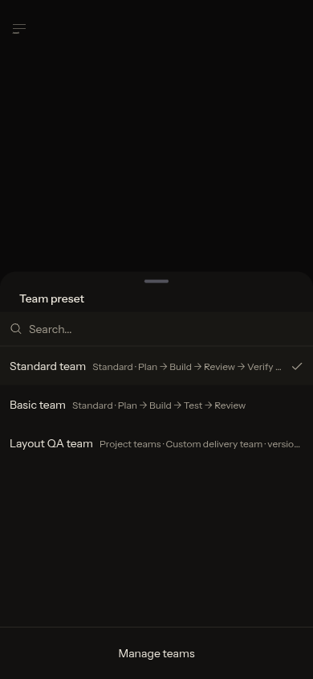 |

The current Team editor was also checked in an actual 430-pixel Mac Electron window: List opens by default, the optional graph responds to wheel zoom, and selecting a role opens this sheet. Native Android touch gestures require a separate device check.

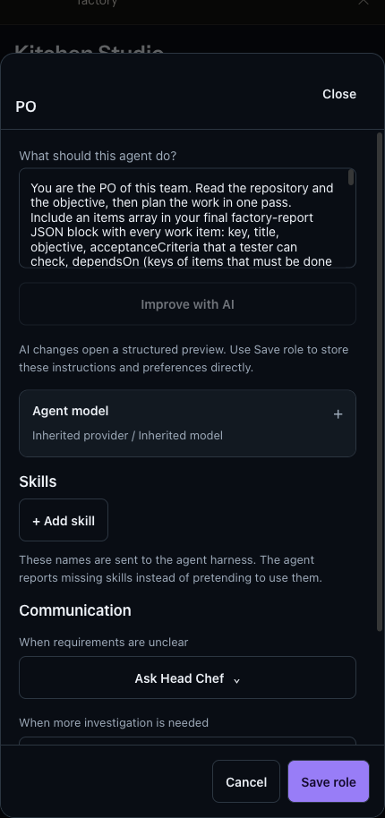

Capture identities and image hashes are retained in [the screenshot receipts](docs/screenshots/captures.json). The [UI review](docs/ux-review.md) records the actual walkthrough, axe results, manual UX rating and remaining device checks.

## Mission continuity and acceptance

The native Head Chef is an ordinary Paseo/PandaOS session, so it uses normal History, Pinned, workspace navigation, attachments and provider permissions. Its Kitchen label links to one authoritative plugin-owned mission. No separate chat database or Core KitchenSession entity is created.

Startup creates or reuses a Head Chef in the actual selected workspace/directory and reserves the first message's stable identity before sending its full text, images and resource references through the normal SDK. Dispatch remains parked until the host acknowledges the initial brief. A reservation is not proof of delivery. Duplicate starts retry the same mission and message identity; reusing an identity with different content is rejected. The plugin records the actual project root, so a mission in an external worktree stays visible under its selected project.

Accepted follow-up messages are persisted and deduplicated in that mission's context, without sending a second copy to the Head Chef. An ordinary client answer can resume one current clarification, requirements or architecture question. Multiple simultaneous questions need an explicit selection; a general reply does not answer them all. Transport origin is not proof of a separate human identity and cannot authorize final acceptance or irreversible actions.

Structured CLI/RPC starts still accept Auto/Single/Team task strategy, separate from the host's Auto model routing. Auto asks Jev System One for a typed execution decision from the goal, criteria, specification and bounded repository context; uncertainty needs human input. Explicit Single/Team does not require Jev. Optional budgets and PR publication settings remain explicit.

The Kitchen pack runs:

- PO planning into bounded work items with dependencies and conflicts.
- Developer in an isolated worktree → editable Reviewer → independent Verifier.
- Verified dependency commits into dependent worktrees.
- An isolated Integrator combining the verified results → an independent final Verifier.
- **Ready for human**. Acceptance requires criterion evidence, no running Cooks, a clean checkout and the actual verified final Git HEAD.

Single runs one Implementer → editable Reviewer → independent Verifier, with no PO or integration team. A Developer profile maps to the Implementer; an explicit Integrator profile takes precedence. Team runs the pipeline above.

Acceptance requires the current verified commit and a provisioned operator credential. The plugin records the credential fingerprint, approval method and commit. Credential possession is not proof of a distinct human identity; an agent with the same OS account can access the same files. Source checkouts remain intact. Acceptance does not deploy or merge.

PR publication is a separate explicit action after acceptance. Configure its remote, branch and base when starting the mission, then approve publication against the accepted commit. A trusted local GitHub-compatible CLI performs the push and PR creation; successful publication is persisted for retry. No automatic merge or deployment occurs.

Use **Team chat** to answer requests for human input: the plugin records the answer, resumes blocked work and sends the actual Head Chef message. **Stages**, **Evidence** and **Activity** expose the result without requiring raw event logs. **Technical details** keeps the work board, role settings, safety state and full history. Mission records remain reachable independently of native agent tabs.

Pause stops new dispatch while current turns finish. Stop interrupts managed turns and leaves the run resumable. Cancel closes the run. Failed decisions and malformed reports retain their evidence and use bounded retry or human escalation. Reload retains running workers and recovers validated reports before sending new work.

## Packs, delegation and schedules

Built-in packs are `kitchen`, `kitchen-single`, `kitchen-insights`, `kitchen-gardener`, and `software-basic`. Insights/Gardener produce proposals from recorded events. **Settings → Improvements** can enable bounded rules that turn specified recurring events into maintenance missions. Rules are disabled by default; cooldowns, source-event deduplication, concurrent-run exclusion, maximum runs and bounded retries limit execution. Each generated mission uses the ordinary verification and approval pipeline.

Goal-driven Team Kitchens accept scoped additional work requests from authorized active roles that the selected pack allows to delegate. Single execution has no delegation. Requests have stable identities, criteria and dependencies and enter the same dispatch queue and verification pipeline. Explicit delegation and additional-item budgets can bound them; fixed plans reject additional work requests.

Schedules use the same Kitchen service and durable start identities. The UI supports cron, explicit time zones, run limits, expiry, pause/resume, manual kickoff, edits and deletion. Missing time zones mean UTC. A pending kickoff survives reload; lost success responses retry the same identity. Missed historical slots do not create a burst of backfilled jobs. Run history reports kickoff success or failure; delivery status belongs to the linked Kitchen.

## Role recipes and project defaults

In **Team → Reusable role presets**, save named recipes with instructions, ordered steps and installed skill names. Provider, model, thinking and permission settings are optional overrides. A workflow-only profile can omit the provider and inherit the chosen role's harness. Models must be advertised by the selected host; an unavailable model is rejected. Permission modes and thinking settings are passed to actual agent creation, rather than only displayed in the editor.

Configure role overrides in **Team** for new native missions, or pass explicit role profiles through the structured CLI/RPC. Repository defaults use `.agent-factory/project.json`:

```json
{
  "workflowPack": "kitchen",
  "roles": {
    "developer": {
      "workflowProfileId": "careful-developer",
      "provider": "codex",
      "model": "your-advertised-model-id",
      "thinking": "your-supported-thinking-id",
      "mode": "your-supported-mode-id",
      "instructions": "Keep each change independently verifiable.",
      "steps": [
        {
          "id": "inspect",
          "title": "Inspect the contract",
          "instructions": "Read the repository instructions and relevant existing tests."
        },
        {
          "id": "implement",
          "title": "Implement and verify",
          "instructions": "Make the bounded change and run the affected checks."
        }
      ]
    }
  }
}
```

The referenced profile must exist in this host's profile catalog. Omit `workflowProfileId` for an inline repository profile. Explicit fields override the referenced profile's values.

For native entry, `workflowId` can select a saved Standard-team variant instead of `workflowPack`. It takes precedence; the team must be available on this host. Optional `headChef` accepts the same role-profile override fields to configure the ordinary coordinating session. **Head Chef preferences** in a saved team override those defaults. Explicit provider/model preferences are honored through manual host routing. A new mission snapshots the selected team revision; editing it later does not retarget running work. Explicit user selection takes precedence over the project default.

Role settings start with the Head Chef's provider, model, mode and thinking. A project's role configuration, or the plugin's configured role default when the project has none, overrides that baseline. Mission role overrides take precedence; a workitem override takes precedence for its next new role agent. Unspecified fields inherit. Changing providers without selecting a model uses the new provider's advertised default.

Resolved mission settings and each binding's executed profile are persisted as snapshots. Editing or deleting a catalog profile does not rewrite existing mission or agent configuration. From Kitchen or a workitem, **Apply to next role agent** records a pending override. It takes effect only when that workitem gets a genuinely new binding: existing agents, nudges and reused agents on a return to the same phase keep their executed profile. Changes during an active start dispatch, or to closed work, are rejected.

Instructions and ordered steps enter the actual role prompt. They guide work within the selected pack's phase; they do not create extra engine phases, replace report schemas or bypass Review, verification or human acceptance. Worker instructions require no private company skills or PandaOS-specific MCP tools.

Programmatic clients use `factory.profiles.list`, `factory.profiles.save`, `factory.profiles.remove` and `factory.work.configure`. Both structured start RPCs accept optional `roleProfiles`; see [the shared contracts](shared/factory-contracts.ts) for their inputs. Native starts resolve the selected team's and project's role settings.

## Reports

A worker finishes with exactly one `factory-report` JSON fence containing `report.outcome` and `report.summary`. Optional artifacts are objects with `kind`, `ref` and optional `note`; criterion evidence uses `id`, `met` and `evidence`. PO reports also contain an `items` array with item keys, goals, acceptance criteria and dependency/conflict keys. Authorized self-organizing roles can include `workRequests` beside the report.

Reports are validated against the active binding and phase. Verification checks the actual checkout rather than accepting a claimed commit hash. Reports and plans are committed atomically; stale, duplicate or invalid reports cannot silently advance the run.

## Host boundaries

Native entry uses generic client execution contributions (`addExecutionMode`, `openNewWorkspace`), the daemon's `agent.user_message_accepted` event carrying the accepted rich prompt, persisted plugin timeline annotations and trusted creation-caller provenance advertised by `server.supportsBeforeHookOrigin("agent.create")`. Kitchen is an orchestration mode; the host creates ordinary agents and conversations while the plugin owns mission state.

| Host                      | Native Kitchen entry                                                                                                                                     |
| ------------------------- | -------------------------------------------------------------------------------------------------------------------------------------------------------- |
| **Current PandaOS**       | Includes the native composer, rich accepted follow-ups, persistent mission card and trusted creation-origin capabilities required by the guarded plugin. |
| **Paseo `0.11.0-beta.3`** | Does not expose these execution/lifecycle APIs. Use a capable host for the native flow.                                                                  |
| **Other Paseo forks**     | Need the same generic public capabilities in both app and daemon. No Kitchen-specific Core entity is required.                                           |

The manifest version range declares loader eligibility; it does not establish that every host version supports native entry. Older compatible hosts can inspect existing missions in Studio and use structured CLI/RPC starts with their supported baseline APIs. An unavailable native action shows an update requirement. Current upstream native compatibility beyond the published beta.3 API is unverified.

The creation guard rejects unmanaged agent creation through the host API by the Head Chef of an open native mission. Factory-controlled workers still use the trusted plugin SDK path. Head Chef instructions require coordination, delegation through Kitchen and verified reporting; they do not provide an OS filesystem sandbox. The earlier `2203fd14c` host has the initial native APIs but lacks the creation-origin capability required by this plugin version. Both the app and daemon must provide their respective capabilities; a client build label alone does not establish daemon support.

Command Center contributions require a current host context: open a workspace or a plugin page first. The host does not expose plugin commands on the unscoped `/open-project` page. Kitchen's Sidebar entry remains available there.

The manifest targets Paseo/PandaOS 0.9.1 through 0.11.x. Newer hosts provide eager plugin API and storage; older hosts need explicit storage and host configuration. Configured older hosts bootstrap their own public SDK connection so persisted schedules resume without opening the UI. For a password-protected older host, configure its local Daemon home and preserve its existing `PASEO_PASSWORD` environment source; passwords are never stored in plugin settings. The plugin remains optional and uses its own `agent-factory.*` labels and state. **Settings → Migration** inspects native stores, backs up selected sources and imports validated closed jobs as read-only history, profiles and trusted packs. Active jobs are preserved and skipped; finish or stop them using their original compatible daemon before replacing it. Older pack modules must still be compatible with the public plugin API. `.pandaos/project.json` supplies validated role defaults when `.agent-factory/project.json` is absent.

The public plugin API cannot veto native agent/workspace archiving, globally hide Cook tabs, replace the native Boss chat renderer, or move an existing agent into another workspace. This plugin keeps jobs in its own accessible UI and reports unsupported moves explicitly. It does not claim native enforcement of those features.

Optional time limits cover measured active binding time. There is no default role or total time cap; enforcement of an explicit limit is periodic. Waiting for a known quota reset does not consume productive time; the plugin persists delayed retry and rejects an early manual retry. Provider-wide fallback, native hard kill and OS sandboxing remain host responsibilities.

Mission limits can bound Worker starts, plugin-dispatched chain steps, managed delegation depth and active time. They do not count every provider-internal tool call or prevent unrelated native spawns. Token and money limits require a trusted complete cumulative team ledger. A selected limit fails closed if the adapter cannot provide the required measurement; no estimated usage is substituted.

## Jev and trusted verification

Jev uses the real [TypeSafe System One API](https://docs.typesafe.ai/api), with validated choices, confidence, observed latency and usage. Existing PandaOS System One enablement and project exclusions are honored. On another Paseo host, enable it with `KITCHEN_SYSTEM_ONE_ENABLED=true` and a server-side TypeSafe credential. Credentials are read from the configured host's `secrets/system-one.json`, `TYPESAFE_API_KEY`, or `TYPESAFE_ENV_FILE` (default `~/.config/typesafe-ai/env`). Never put a key in plugin settings, role prompts or the repository.

When System One is enabled, a substantive ordinary chat about a project with several connected areas can receive a Kitchen suggestion. Short greetings and existing Kitchen members are excluded. A confident Team decision creates one offer; **Review Kitchen mission** opens a prefilled native draft and work starts only when you send it. **Keep chatting** dismisses the offer locally. Set `KITCHEN_SUGGESTIONS_ENABLED=false` to disable these classifications. Team-editor natural-language previews and required outcome judging also use the configured external decision service.

**Require trusted outcome judge** asks Jev to assess acceptance after physical checks. A semantic pass cannot authorize missing or failed independent checks. Low confidence or an unavailable required judge blocks acceptance.

Provision trusted checks outside the checkout in `<Kitchen data directory>/runtime-checks.json` (or `KITCHEN_CHECKS_FILE`). The daemon user must own the regular file; other users must not be able to write it. Commands come only from this operator configuration, never from worker reports or RPC inputs. Example:

```json
{
  "commands": {
    "tests": { "executable": "/absolute/path/to/npm", "argv": ["run", "test:acceptance"] }
  },
  "checks": [
    { "id": "acceptance-tests", "criterionId": "tests", "kind": "command", "commandId": "tests" }
  ],
  "requireCriterionEvidence": true,
  "publicationCli": { "executable": "/absolute/path/to/gh" }
}
```

Criterion IDs must match the mission. Required criterion evidence needs a passed command or browser-artifact receipt for each criterion at the actual candidate commit. Browser receipts additionally require `artifactRoot` and a check with `artifactPath` and `artifactSha256`; `requireBrowserEvidence` makes one mandatory. The file must be inside the configured root and have a valid image signature. Its hash proves artifact identity, not every semantic claim in a report. Verifier HEAD, tracked files, modes and checkout state are captured before and after its turn; unexpected changes block verification. These checks detect mutations; provider permissions and an OS sandbox provide technical read-only enforcement.

An optional `usageCommandId` invokes a configured command with the team and agent IDs as JSON. It must return the matching `teamId`, `scope: "team"`, `cumulative: true`, `complete: true`, and measured `tokens` and/or `costUsd`. Missing coverage blocks the selected budget. Reload after editing trusted runtime configuration.

Provision a private, daemon-owned `operator-credential` file in the Kitchen data directory with at least 32 characters and mode 0600, or use `KITCHEN_OPERATOR_CREDENTIAL_FILE`. The acceptance form uses this transient credential; it is not stored in plugin settings or reports. `KITCHEN_OPERATOR_CREDENTIAL` is also supported for an existing protected environment source.

## CLI, MCP and persistence

The plugin includes a standalone bridge, without reinstating host-native team commands:

```sh
KITCHEN_DAEMON_URL=ws://127.0.0.1:6767/ws node server/kitchen.mjs list
KITCHEN_DAEMON_URL=ws://127.0.0.1:6767/ws node server/kitchen.mjs start --input mission.json
KITCHEN_DAEMON_URL=ws://127.0.0.1:6767/ws node server/kitchen.mjs --mcp
```

Use `--help` for supported commands. Passwords come from `PASEO_PASSWORD`. `KITCHEN_AGENT_ID` filters the bridge to the current managed role and prevents cross-mission requests or impersonation through that bridge. It does not replace the host's entire MCP catalog or restrict an OS account that can launch another process.

One runtime owns each Kitchen data directory. Per-team file locks serialize writes across processes; committed event counts reject corrupt committed history and discard incomplete uncommitted tails. A second runtime is rejected. Locks are not stolen after a crash: stop every instance before an operator removes a stale lock. Durable identities cover reports, schedules and retries; the public host API does not guarantee exactly-once external agent creation after a crash.

## Development

```sh
npm install --ignore-scripts
npm run typecheck
npm run lint
npm run format:check
npm run test -- server/service.test.ts
```

Targeted suites cover persistence, cross-process commits, runtime ownership, Single/Team decisions, role profiles, limits, trusted checks, approvals, migration, improvement rules, recovery and client behavior. The existing installed-plugin runtime test exercises two dependent items, a Reviewer code change, a failed verification and return, actual integration, reload and explicit human acceptance. Compatibility and installed UI evidence are recorded separately from deterministic fixtures; a passing runtime fixture alone does not verify the Studio UI.
