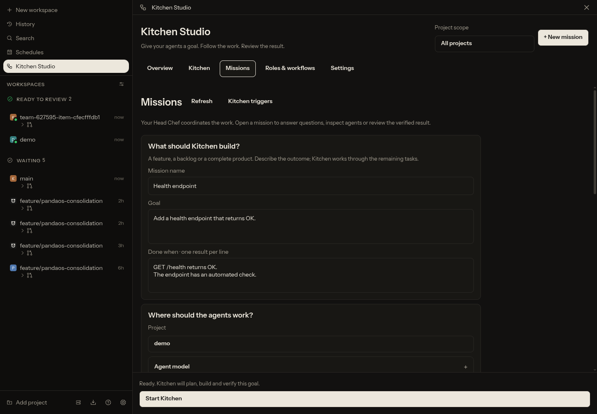

# Kitchen Studio

A portable Paseo plugin for turning a goal into verified software. Give your Head Chef a feature, backlog or product goal, follow the agents in the live Kitchen, answer their questions and inspect the result before accepting it. The work dashboard and software factory share one plugin. Projects are selected once in the Studio header.

A Head Chef coordinates remaining work, isolated developer worktrees, editable reviews, independent verification, combined integration and human acceptance. The plugin owns its persisted jobs, bindings, queue, evidence, runtime limits and Kitchen schedules. It uses public Paseo APIs and the public host CLI.

The hierarchy is inspired by [Agent Crew](https://paseo.cafe/plugins/agent-crew/), and the office presentation by Claw3D. The office is an original procedural Three.js scene: no Claw3D application code or assets are included. LICENSE and NOTICE preserve the Paseo, PandaOS and Mastra adaptations and the Three.js license.

## Install and configure

The plugin-only repository is [marushan491/paseo-kitchen](https://github.com/marushan491/paseo-kitchen). Clone it directly; the plugin is open source under Apache-2.0. Install it on a supported Paseo host; no source changes to the host are required.

Install dependencies, then install the cloned directory on the target host:

```sh
git clone https://github.com/marushan491/paseo-kitchen.git
cd paseo-kitchen
npm install --ignore-scripts
paseo plugin install "$PWD"
```

For PandaOS, use `pandaos plugin install` with the same directory. Enable plugins on that host. Open **Kitchen Studio** from the sidebar or command center. On hosts without a global plugin screen, open its workspace panel. Open **Settings → Connection & capacity**: choose the host connection once, then leave advanced fields collapsed. Configure:

| Setting                   | Value                                                                                                                                                    |
| ------------------------- | -------------------------------------------------------------------------------------------------------------------------------------------------------- |
| Data directory            | Leave empty when the host provides plugin storage. Otherwise choose an absolute directory outside all project checkouts, dedicated to this installation. |
| Daemon home               | The absolute home of this host. An explicit inherited `PASEO_HOME` also works.                                                                           |
| Daemon endpoint           | Alternative to Daemon home, pointing to this same host. Do not set both.                                                                                 |
| CLI executable            | `paseo`, `pandaos`, or the absolute path to the installed CLI.                                                                                           |
| CLI arguments             | Optional argument prefix when the executable is a launcher.                                                                                              |
| Pack directory            | Optional absolute directory containing trusted `<pack>/pack.mjs` modules.                                                                                |
| Maximum concurrent agents | Requested concurrency across managed teams; the built-in runtime caps active Cooks at four.                                                              |

Reload the plugin after changing storage, host, CLI or pack settings. Concurrency updates apply immediately. Kitchen preflight checks the configured CLI before creating agents. Every CLI mutation compares the selected agent with the public SDK snapshot to prevent operation against the wrong daemon. There is no implicit production-host fallback.

## Start your first mission

1. Choose a project in the Studio header and click **New mission**.
2. Describe the goal and the observable results under **Done when**. The goal can span several features.
3. Keep **Until the goal is done**. The Head Chef plans work and agents can request the next scoped tasks and dependencies as they discover what remains.
4. Open **Agent model** only to change the selected provider/model. **Roles & workflow** explains the built-in roles and lets you add instructions and installed skill names for each role.
5. Click **Start Kitchen**. Follow the mission, answer questions in Team chat and inspect its verification evidence when it becomes **Ready for human**.

The default role chain is Head Chef → Developer → Reviewer → Verifier → Integrator → Final Verifier. You do not have to create profiles before starting. **Advanced options** contains execution classification, alternate packs, optional budgets and PR publication. Automatic execution uses the configured decision provider to choose Single or Team; it is separate from the host's model-selection setting.

The built-in Team Kitchen has no implicit token, cost, duration, delegation-depth or additional-item caps. Single execution does not delegate; external packs can define their own structural limits. The default capacity is four concurrent Cooks; queued work continues as capacity becomes available. An explicit budget remains binding. A missing provider quota, human answer or required evidence can pause progress; Kitchen resumes through its persisted runtime rather than inventing a successful result. It stops when the stated goal has a verified result and waits for acceptance. It does not automatically approve, merge or deploy.

## Screens and navigation

Screenshots below show an installed plugin in PandaOS using an isolated demo project and example historical mission records. They document the interface, not a claim that the example agents are currently working. Web and desktop have the 3D Kitchen; native clients retain the selectable role list.

| Screen                | What you do here                                                                                                                                                                    |
| --------------------- | ----------------------------------------------------------------------------------------------------------------------------------------------------------------------------------- |
| **Overview**          | Find the next human action. **Needs you**, **Activity** and **Problems** share this page instead of duplicating navigation. Open a session, inspect its handoff or snooze an entry. |
| **Kitchen**           | See actual role bindings at kitchen stations. Select a chef or role card to inspect its agent, open the mission or configure its next role agent.                                   |
| **Missions**          | Start a goal, select a persisted run, answer questions in Team chat and inspect work items, dependencies and acceptance evidence.                                                   |
| **Roles & workflows** | Read the standard responsibilities. Customize a role or save reusable instructions, ordered steps, skills and optional provider/model overrides.                                    |
| **Settings**          | Set host connection and capacity once. Dashboard preferences, migration and automatic follow-up rules live in separate sections; technical fields are collapsible.                  |

### Overview


The header's project scope also filters the Kitchen, missions, activity and schedules. Select **All projects** for a cross-project view. A session's Done/Reopen and snooze preferences belong to the dashboard; accepted mission state remains separate from merely finishing an agent turn.

### Kitchen


Preparation boards, cooking stations, review plates and verification sinks correspond to real roles. Furniture remains visible in an empty Kitchen; chefs appear only for actual bindings. Selecting a station connects the visualization to the agent and mission controls below it.

### Missions and starting work




The persistent start button explains missing required input. Name, goal, acceptance criteria and project are the essentials. Roles inherit the chosen host settings and built-in pack instructions until you override them. Budgets and publication settings stay under **Advanced options**.

### Roles and workflows


Use **Customize** on a standard role to start from its actual instructions. Save a named profile, then assign it to a mission role. Extra role instructions and installed skills are also available without creating a profile. Naming a skill does not install it: the harness resolves its installed skill and must report a missing skill.

### Settings


Set concurrent Cooks to control simultaneous execution. Connection, storage and external-pack fields are disclosed when needed. Changing host or storage requires reloading the plugin; changing capacity applies immediately.

## Dashboard and Kitchen

Overview groups connected workspaces and agents and surfaces requests that need a human response. Activity shows workspace progress; Problems separates failed agents, failed checks and schedule errors. Open the affected agent, inspect its handoff, reply or mark the Dashboard session done. Snooze hides an inbox entry for one hour, until this evening or until tomorrow morning; it returns at its wake time. Snoozing does not stop the agent or resolve its request.

Dashboard preferences use the plugin's own persistent store. **Settings → Dashboard** accepts an exported preference JSON to import existing snoozes without changing the original store. Existing workspace Done and handoff metadata is read from public snapshots. An accepted Kitchen contributes Done only when no linked work remains active. Dashboard Done/Reopen changes visibility in its own store; it does not archive agents or rewrite native workspace metadata.

Host schedule monitoring requires Overview's explicit daemon home and public CLI settings. Additional hosts use exact app server IDs mapped to explicit endpoints. Unknown or unreachable targets produce a visible error; the plugin does not substitute another host or forward the local password to a remote endpoint. Supported new-agent schedules have confirmed pause and run-once actions. Heartbeat controls remain with the owning agent and are unavailable here. Overview also lists Kitchen mission schedules and opens the corresponding mission. Host and Kitchen schedules retain their own execution stores.

Kitchen projects real mission bindings and public agent snapshots into cooking stations. On web and desktop, the interactive 3D scene lets you select a chef or station, inspect the agent or open its mission. Native clients use the role list. When WebGL is unavailable, the role list remains available with the renderer's reason. Missing live agent data is marked unobserved; the scene does not invent activity or usage.

## Run a Kitchen mission

Open Kitchen Studio from the workspace Explorer, Sidebar or Command Center, then choose **New mission**. From an agent, choose **Hand off to Kitchen** to retain a source link and its provider/model/mode/thinking settings. You can also start from a project and explicitly select a provider and model.

Enter a goal, optional specification and observable acceptance criteria. Choose Auto, Single or Team execution. Auto asks Jev AI System One for a typed decision from the goal, criteria, specification and bounded repository context; uncertain decisions require human input. Explicit Single/Team selection does not need Jev. Keep goal-driven work or choose a fixed plan; optional feature/bug/maintenance classification and alternate packs are under Advanced options. Duplicate submissions keep the same request identity; a reused identity with different content is rejected.

The Kitchen pack runs:

- PO planning into bounded work items with dependencies and conflicts.
- Developer in an isolated worktree → editable Reviewer → independent Verifier.
- Verified dependency commits into dependent worktrees.
- An isolated Integrator combining the verified results → an independent final Verifier.
- **Ready for human**. Acceptance requires criterion evidence, no running Cooks, a clean checkout and the actual verified final Git HEAD.

Single runs one Implementer → editable Reviewer → independent Verifier, with no PO or integration team. A Developer profile maps to the Implementer; an explicit Integrator profile takes precedence. Team runs the pipeline above.

Acceptance requires the current verified commit and a provisioned operator credential. The plugin records the credential fingerprint, approval method and commit. Credential possession is not proof of a distinct human identity; an agent with the same OS account can access the same files. Source checkouts remain intact. Acceptance does not deploy or merge.

PR publication is a separate explicit action after acceptance. Configure its remote, branch and base when starting the mission, then approve publication against the accepted commit. A trusted local GitHub-compatible CLI performs the push and PR creation; successful publication is persisted for retry. No automatic merge or deployment occurs.

Use **Team chat** to answer requests for human input: the plugin records the answer, resumes blocked work and sends the actual Boss message. **Agents** exposes read-only, paginated Cook histories. **Mission** contains the board, verification, insights and safety state. Mission records remain reachable independently of native agent tabs.

Pause stops new dispatch while current turns finish. Stop interrupts managed turns and leaves the run resumable. Cancel closes the run. Failed decisions and malformed reports retain their evidence and use bounded retry or human escalation. Reload retains running workers and recovers validated reports before sending new work.

## Packs, delegation and schedules

Built-in packs are `kitchen`, `kitchen-single`, `kitchen-insights`, `kitchen-gardener`, and `software-basic`. Insights/Gardener produce proposals from recorded events. **Settings → Improvements** can enable bounded rules that turn specified recurring events into maintenance missions. Rules are disabled by default; cooldowns, source-event deduplication, concurrent-run exclusion, maximum runs and bounded retries limit execution. Each generated mission uses the ordinary verification and approval pipeline.

Goal-driven Team Kitchens accept scoped additional work requests from authorized active roles that the selected pack allows to delegate. Single execution has no delegation. Requests have stable identities, criteria and dependencies and enter the same dispatch queue and verification pipeline. Explicit delegation and additional-item budgets can bound them; fixed plans reject additional work requests.

Schedules use the same Kitchen service and durable start identities. The UI supports cron, explicit time zones, run limits, expiry, pause/resume, manual kickoff, edits and deletion. Missing time zones mean UTC. A pending kickoff survives reload; lost success responses retry the same identity. Missed historical slots do not create a burst of backfilled jobs. Run history reports kickoff success or failure; delivery status belongs to the linked Kitchen.

## Workflow profiles and role assignments

In **Roles & workflows**, save named profiles with instructions, ordered steps and installed skill names. Provider, model, thinking and permission settings are optional overrides. A workflow-only profile can omit the provider and inherit the chosen role's harness. Models must be advertised by the selected host; an unavailable model is rejected. Permission modes and thinking settings are passed to actual agent creation, rather than only displayed in the editor.

Assign profiles to the selected pack's roles when starting a mission. Repository defaults use `.agent-factory/project.json`:

```json
{
  "workflowPack": "kitchen",
  "roles": {
    "developer": {
      "workflowProfileId": "careful-developer",
      "provider": "codex",
      "model": "your-advertised-model-id",
      "thinking": "your-supported-thinking-id",
      "mode": "your-supported-mode-id",
      "instructions": "Keep each change independently verifiable.",
      "steps": [
        {
          "id": "inspect",
          "title": "Inspect the contract",
          "instructions": "Read the repository instructions and relevant existing tests."
        },
        {
          "id": "implement",
          "title": "Implement and verify",
          "instructions": "Make the bounded change and run the affected checks."
        }
      ]
    }
  }
}
```

The referenced profile must exist in this host's profile catalog. Omit `workflowProfileId` for an inline repository profile. Explicit fields override the referenced profile's values.

Role settings start with the Head Chef's provider, model, mode and thinking. A project's role configuration, or the plugin's configured role default when the project has none, overrides that baseline. Mission role overrides take precedence; a workitem override takes precedence for its next new role agent. Unspecified fields inherit. Changing providers without selecting a model uses the new provider's advertised default.

Resolved mission settings and each binding's executed profile are persisted as snapshots. Editing or deleting a catalog profile does not rewrite existing mission or agent configuration. From Kitchen or a workitem, **Apply to next role agent** records a pending override. It takes effect only when that workitem gets a genuinely new binding: existing agents, nudges and reused agents on a return to the same phase keep their executed profile. Changes during an active start dispatch, or to closed work, are rejected.

Instructions and ordered steps enter the actual role prompt. They guide work within the selected pack's phase; they do not create extra engine phases, replace report schemas or bypass Review, verification or human acceptance. Worker instructions require no private company skills or PandaOS-specific MCP tools.

Programmatic clients use `factory.profiles.list`, `factory.profiles.save`, `factory.profiles.remove` and `factory.work.configure`. Both start RPCs accept optional `roleProfiles`; see [the shared contracts](shared/factory-contracts.ts) for their inputs.

## Reports

A worker finishes with exactly one `factory-report` JSON fence containing `report.outcome` and `report.summary`. Optional artifacts are objects with `kind`, `ref` and optional `note`; criterion evidence uses `id`, `met` and `evidence`. PO reports also contain an `items` array with item keys, goals, acceptance criteria and dependency/conflict keys. Authorized self-organizing roles can include `workRequests` beside the report.

Reports are validated against the active binding and phase. Verification checks the actual checkout rather than accepting a claimed commit hash. Reports and plans are committed atomically; stale, duplicate or invalid reports cannot silently advance the run.

## Host boundaries

Command Center contributions require a current host context: open a workspace or a plugin page first. The host does not expose plugin commands on the unscoped `/open-project` page. Kitchen’s Sidebar entry remains available there.

The manifest targets Paseo/PandaOS 0.9.1 through 0.11.x. Newer hosts provide eager plugin API and storage; older hosts need explicit storage and host configuration. Configured older hosts bootstrap their own public SDK connection so persisted schedules resume without opening the UI. For a password-protected older host, configure its local Daemon home and preserve its existing `PASEO_PASSWORD` environment source; passwords are never stored in plugin settings. The plugin remains optional and uses its own `agent-factory.*` labels and state. Existing built-in PandaOS jobs continue in their existing coordinator; **Settings → Migration** inspects native stores, backs up selected sources and imports validated closed jobs as read-only history, profiles and trusted packs. Active jobs stay with their existing coordinator. Older pack modules must still be compatible with the public plugin API. `.pandaos/project.json` supplies validated role defaults when `.agent-factory/project.json` is absent.

The public plugin API cannot veto native agent/workspace archiving, globally hide Cook tabs, replace the native Boss chat renderer, or move an existing agent into another workspace. This plugin keeps jobs in its own accessible UI and reports unsupported moves explicitly. It does not claim native enforcement of those features.

Optional time limits cover measured active binding time. There is no default role or total time cap; enforcement of an explicit limit is periodic. Waiting for a known quota reset does not consume productive time; the plugin persists delayed retry and rejects an early manual retry. Provider-wide fallback, native hard kill and OS sandboxing remain host responsibilities.

Mission limits can bound Worker starts, plugin-dispatched chain steps, managed delegation depth and active time. They do not count every provider-internal tool call or prevent unrelated native spawns. Token and money limits require a trusted complete cumulative team ledger. A selected limit fails closed if the adapter cannot provide the required measurement; no estimated usage is substituted.

## Jev and trusted verification

Jev uses the real [TypeSafe System One API](https://docs.typesafe.ai/api), with validated choices, confidence, observed latency and usage. Existing PandaOS System One enablement and project exclusions are honored. On another Paseo host, enable it with `KITCHEN_SYSTEM_ONE_ENABLED=true` and a server-side TypeSafe credential. Credentials are read from the configured host's `secrets/system-one.json`, `TYPESAFE_API_KEY`, or `TYPESAFE_ENV_FILE` (default `~/.config/typesafe-ai/env`). Never put a key in plugin settings, role prompts or the repository.

**Require trusted outcome judge** asks Jev to assess acceptance after physical checks. A semantic pass cannot authorize missing or failed independent checks. Low confidence or an unavailable required judge blocks acceptance.

Provision trusted checks outside the checkout in `<Kitchen data directory>/runtime-checks.json` (or `KITCHEN_CHECKS_FILE`). The daemon user must own the regular file; other users must not be able to write it. Commands come only from this operator configuration, never from worker reports or RPC inputs. Example:

```json
{
  "commands": {
    "tests": { "executable": "/absolute/path/to/npm", "argv": ["run", "test:acceptance"] }
  },
  "checks": [
    { "id": "acceptance-tests", "criterionId": "tests", "kind": "command", "commandId": "tests" }
  ],
  "requireCriterionEvidence": true,
  "publicationCli": { "executable": "/absolute/path/to/gh" }
}
```

Criterion IDs must match the mission. Required criterion evidence needs a passed command or browser-artifact receipt for each criterion at the actual candidate commit. Browser receipts additionally require `artifactRoot` and a check with `artifactPath` and `artifactSha256`; `requireBrowserEvidence` makes one mandatory. The file must be inside the configured root and have a valid image signature. Its hash proves artifact identity, not every semantic claim in a report. Verifier HEAD, tracked files, modes and checkout state are captured before and after its turn; unexpected changes block verification. These checks detect mutations; provider permissions and an OS sandbox provide technical read-only enforcement.

An optional `usageCommandId` invokes a configured command with the team and agent IDs as JSON. It must return the matching `teamId`, `scope: "team"`, `cumulative: true`, `complete: true`, and measured `tokens` and/or `costUsd`. Missing coverage blocks the selected budget. Reload after editing trusted runtime configuration.

Provision a private, daemon-owned `operator-credential` file in the Kitchen data directory with at least 32 characters and mode 0600, or use `KITCHEN_OPERATOR_CREDENTIAL_FILE`. The acceptance form uses this transient credential; it is not stored in plugin settings or reports. `KITCHEN_OPERATOR_CREDENTIAL` is also supported for an existing protected environment source.

## CLI, MCP and persistence

The plugin includes a standalone bridge, without reinstating host-native team commands:

```sh
KITCHEN_DAEMON_URL=ws://127.0.0.1:6767/ws node server/kitchen.mjs list
KITCHEN_DAEMON_URL=ws://127.0.0.1:6767/ws node server/kitchen.mjs start --input mission.json
KITCHEN_DAEMON_URL=ws://127.0.0.1:6767/ws node server/kitchen.mjs --mcp
```

Use `--help` for supported commands. Passwords come from `PASEO_PASSWORD`. `KITCHEN_AGENT_ID` filters the bridge to the current managed role and prevents cross-mission requests or impersonation through that bridge. It does not replace the host's entire MCP catalog or restrict an OS account that can launch another process.

One runtime owns each Kitchen data directory. Per-team file locks serialize writes across processes; committed event counts reject corrupt committed history and discard incomplete uncommitted tails. A second runtime is rejected. Locks are not stolen after a crash: stop every instance before an operator removes a stale lock. Durable identities cover reports, schedules and retries; the public host API does not guarantee exactly-once external agent creation after a crash.

## Development

```sh
npm install --ignore-scripts
npm run typecheck
npm run lint
npm run format:check
npm run test -- server/service.test.ts
```

Targeted suites cover persistence, cross-process commits, runtime ownership, Single/Team decisions, role profiles, limits, trusted checks, approvals, migration, improvement rules, recovery and client behavior. The existing installed-plugin runtime test exercises two dependent items, a Reviewer code change, a failed verification and return, actual integration, reload and explicit human acceptance. Compatibility and installed UI evidence are recorded separately from deterministic fixtures; a passing runtime fixture alone does not verify the Studio UI.
